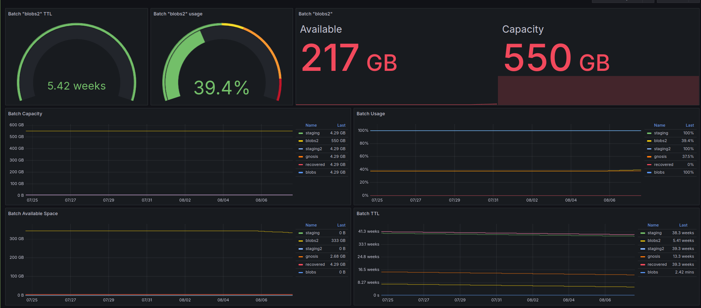

# Swarm batch prometheus exporter

This is a simple [Prometheus](https://prometheus.io/) exporter to expose stamp batch metrics for [Ethereum Swarm](https://www.ethswarm.org/).

## Usage

```
# Compile
make build

# Run
./swarm-batch-exporter
```

```
# Scrape
curl http://localhost:1640/metrics
```

### Docker

Docker image is available at [Docker Hub](https://hub.docker.com/r/blossomlabs/swarm-batch-prometheus)

```
docker pull blossomlabs/swarm-batch-prometheus
docker run --rm --network host -e BEE_ENDPOINT=http://localhost:1633 blossomlabs/swarm-batch-prometheus
```

## Metrics

* `swarm_batch_avail_bytes` (gauge)
* `swarm_batch_size_bytes` (gauge)
* `swarm_batch_depth` (gauge)
* `swarm_batch_ttl` (gauge)
* `swarm_batch_usage_percentage` (gauge)
* `swarm_batch_utilization` (gauge)

Example:

```
# HELP swarm_batch_avail_bytes Stamp batch available capacity in bytes.
# TYPE swarm_batch_avail_bytes gauge
swarm_batch_avail_bytes{batchID="394c6927473b0441b7e0a2bfd94494c4de5b3a3a1515e9689f03d4aac32d7913",label="blobs2"} 1.62940321792e+11
swarm_batch_avail_bytes{batchID="f384b94640b64d04d738eec79fc82a18dde7bc9677b0be28836dd63957b72e46",label="blobs"} 4.294967296e+09
# HELP swarm_batch_size_bytes Stamp batch total capacity in bytes.
# TYPE swarm_batch_size_bytes gauge
swarm_batch_size_bytes{batchID="394c6927473b0441b7e0a2bfd94494c4de5b3a3a1515e9689f03d4aac32d7913",label="blobs2"} 2.74877906944e+11
swarm_batch_size_bytes{batchID="f384b94640b64d04d738eec79fc82a18dde7bc9677b0be28836dd63957b72e46",label="blobs"} 4.294967296e+09
# HELP swarm_batch_depth Stamp batch depth.
# TYPE swarm_batch_depth gauge
swarm_batch_depth{batchID="394c6927473b0441b7e0a2bfd94494c4de5b3a3a1515e9689f03d4aac32d7913",label="blobs2"} 26
swarm_batch_depth{batchID="f384b94640b64d04d738eec79fc82a18dde7bc9677b0be28836dd63957b72e46",label="blobs"} 20
# HELP swarm_batch_ttl Stamp batch TTL.
# TYPE swarm_batch_ttl gauge
swarm_batch_ttl{batchID="394c6927473b0441b7e0a2bfd94494c4de5b3a3a1515e9689f03d4aac32d7913",label="blobs2"} 2.990461e+06
swarm_batch_ttl{batchID="f384b94640b64d04d738eec79fc82a18dde7bc9677b0be28836dd63957b72e46",label="blobs"} 133323
# HELP swarm_batch_usage_percentage Stamp batch usage percentage.
# TYPE swarm_batch_usage_percentage gauge
swarm_batch_usage_percentage{batchID="394c6927473b0441b7e0a2bfd94494c4de5b3a3a1515e9689f03d4aac32d7913",label="blobs2"} 0.5927734375
swarm_batch_usage_percentage{batchID="f384b94640b64d04d738eec79fc82a18dde7bc9677b0be28836dd63957b72e46",label="blobs"} 1
# HELP swarm_batch_utilization Stamp batch utilization.
# TYPE swarm_batch_utilization gauge
swarm_batch_utilization{batchID="394c6927473b0441b7e0a2bfd94494c4de5b3a3a1515e9689f03d4aac32d7913",label="blobs2"} 607
swarm_batch_utilization{batchID="f384b94640b64d04d738eec79fc82a18dde7bc9677b0be28836dd63957b72e46",label="blobs"} 16
```

## Screenshot



